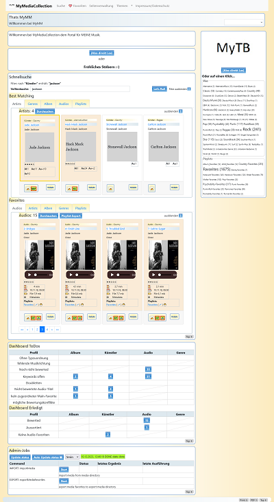

# MyMediaCollection-Electron-App

MyMediaCollection is an application for managing your media-resources as audio, video.
It's based on mymediacollection and mysimplehomepage-electron.

**But be aware: it start's a local server with default-passwords!!!!!**

For more information take a look at documentation:
- [portalinfo](docs/INFO.md)
- [changelog](docs/CHANGELOG.md) 
- [installation/run instructions](docs/INSTALL.md)
- [configuration instructions](docs/CONFIGURATION.md)
- [credits for used libraries](docs/CREDITS.md)

